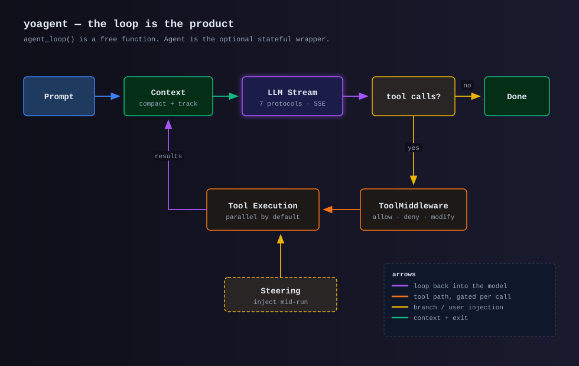

# yoagent

**The agent loop for Rust.** Stream from any of 7 LLM protocols, run tools, loop until done.

yoagent is a library for building LLM-powered agents that use tools. It provides the core loop —
prompt the model, execute tool calls, feed results back — and gets out of your way.



## Philosophy

**The loop is the product.** An agent is just a loop: send messages to an LLM, get back text and
tool calls, execute the tools, repeat until the model stops. yoagent implements that loop with
streaming, cancellation, context management, and multi-provider support — and stops there.

`agent_loop()` is a stateless free function that takes everything it needs as arguments. `Agent`
is an *optional* wrapper that adds message history, a tool registry, and steering queues. You can
drive the loop yourself without adopting our state model.

## Try it without an API key

```bash
git clone https://github.com/yologdev/yoagent && cd yoagent
ollama serve &
cargo run --example cli -- --provider ollama
```

A working coding agent in your terminal — file read/write/edit, shell, ripgrep search, streaming
output, and skills.

## What's here

**The loop and its control surfaces**

- [The agent loop](concepts/agent-loop.md) — how a turn runs, and how steering and follow-ups interrupt it
- [Messages and events](concepts/messages-events.md) — the full `AgentEvent` stream for text deltas, thinking, and tool execution
- [Tool middleware](concepts/tools.md#permissions-tool-middleware) — async allow / modify / deny hooks gating every tool call
- [Lifecycle callbacks](concepts/callbacks.md) plus execution limits (max turns, tokens, wall-clock) and `CancellationToken` abort
- [Retry](concepts/retry.md) with exponential backoff and jitter, for rate-limit and network errors only

**Models and tools**

- [7 API protocols, 20+ providers](providers/overview.md) — Anthropic, OpenAI Completions and Responses, Azure, Gemini, Vertex, Bedrock, plus OpenAI-compatible gateways, each with a real implementation rather than a shared shim
- [Built-in tools](concepts/tools.md) — bash, file read/write/edit, list, ripgrep search; add your own via the `AgentTool` trait
- [MCP](guides/mcp.md) servers and [OpenAPI](guides/openapi.md) specs become tools transparently
- [Structured outputs](concepts/structured-outputs.md) — typed, schema-validated replies enforced natively where the provider supports it
- [Prompt caching](concepts/prompt-caching.md)

**Scaling a session**

- [Sub-agents and shared state](concepts/sub-agents.md) — delegate to child loops with their own model, tools, and limits; sub-agents read large artifacts by key instead of re-pasting them into every context window
- [Context management](concepts/context-management.md) — token tracking and tiered compaction (truncate tool outputs → summarise old turns → drop middle)
- [State persistence](concepts/persistence.md) — save and restore a run
- [Session trees](concepts/session-trees.md) — branching history with fork, checkpoints, and JSONL persistence
- [Skills](concepts/skills.md) — load AgentSkills-standard `SKILL.md` directories

**Running it in production**

- [Telemetry](concepts/telemetry.md) — `tracing` spans per loop, LLM stream, and tool, with token and cost fields
- Cost tracking with separate cache-read and cache-write rates
- [GASP](concepts/gasp.md) — record runs as an append-only semantic event log; restore is clone + replay

## Ecosystem

yoagent is part of the [Yolog](https://github.com/yologdev) ecosystem. It powers the agent backend
for Yolog applications.

- **Repository:** [github.com/yologdev/yoagent](https://github.com/yologdev/yoagent)
- **API reference:** [docs.rs/yoagent](https://docs.rs/yoagent)
- **License:** MIT
